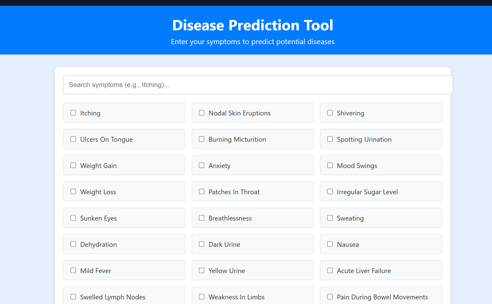
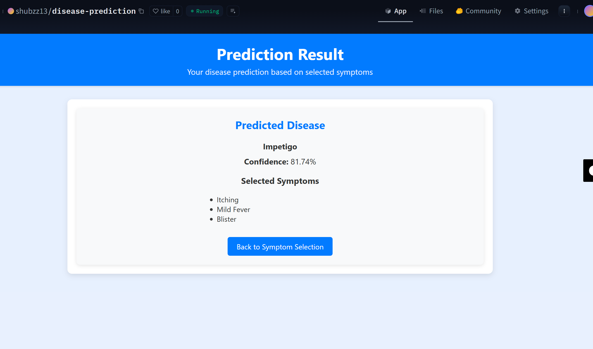

# 🩺 Disease Prediction Project

[](https://huggingface.co/spaces/shubzz13/disease-prediction)

## 📌 Overview
This project is a **machine learning-based web application** for predicting diseases from user-input symptoms.  

* Dependencies (see `requirements.txt`):

```txt
pandas
numpy
scikit-learn
xgboost
statsmodels
flask
joblib
matplotlib
seaborn
```

---

## ⚡ Setup (Local Development)

1. **Clone the Repository**

   ```bash
   git clone https://github.com/your-username/disease-prediction.git
   cd disease-prediction
   ```

2. **Set Up Virtual Environment (optional)**

   ```bash
   python -m venv dp_env
   .\dp_env\Scripts\activate  # Windows
   ```

3. **Install Dependencies**

   ```bash
   pip install -r requirements.txt
   ```

4. **Directory Structure**

   ```
   project_root/
   ├── data/
   │   ├── raw/                    # train.csv, test.csv
   │   ├── processed/              # train_reduced_vif.csv, test_reduced_vif.csv
   ├── models/                     # trained_model.pkl, label_encoder.pkl
   ├── predictions/                # predictions.csv
   ├── Notebooks/                  # Jupyter notebooks for exploration
   ├── src/                        # Python scripts and Flask app
   ├── static/                     # CSS for Flask UI
   ├── templates/                  # HTML templates for Flask
   ├── requirements.txt
   ├── README.md
   ```

---

## 🚀 Usage

### Preprocess Data

```bash
python src/data/preprocess.py
```

**Outputs**:

* `data/processed/train_reduced_vif.csv`
* `data/processed/test_reduced_vif.csv`
* `models/label_encoder.pkl`

### Train Model

```bash
python src/models/train.py
```

**Outputs**:

* `models/trained_model.pkl`

### Generate Predictions

```bash
python src/models/predict.py
```

**Outputs**:

* `predictions/predictions.csv` (42 rows, prognosis\_encoded, prognosis)

### Run Flask App (Locally)

```bash
python src/app.py
```

Open: [http://127.0.0.1:5000](http://127.0.0.1:5000)

---

## 🌍 Deployment

The app is live on **Hugging Face Spaces**:
👉 [https://huggingface.co/spaces/shubzz13/disease-prediction](https://huggingface.co/spaces/shubzz13/disease-prediction)

Deployment steps:

1. Create a Hugging Face Space with **Docker SDK**.
2. Push your repo:

   ```bash
   git push hf main
   ```
3. Hugging Face automatically builds & hosts the app.

---

## 📊 Results

* **Data**: Reduced from 132 to \~40–50 features via VIF (threshold=5).
* **Models**: Logistic Regression achieves **>97% accuracy** on validation & test sets.
* **UI**: Modern Flask app with responsive grid + symptom search.
* **Outputs**: Accurate `predictions.csv` for 42 diseases.

---

## 📓 Notebooks

* `data_preparation.ipynb` → Data cleaning and preprocessing.
* `exploratory_data_analysis.ipynb` → Visualizations + VIF analysis.
* `model_training.ipynb` → Model tuning & evaluation.

---

## 📸 Demo




---

## 📬 Contact

* 📧 Email: [mshubham707@gmail.com](mailto:mshubham707@gmail.com)
* 💻 GitHub: [mshubham707](https://github.com/mshubham707)

---

## 🙏 Acknowledgments

Built for a **hackathon** to demonstrate an end-to-end ML pipeline, from preprocessing to deployment.
Part of the **PW Skills Data Analytics Certification**.

```
